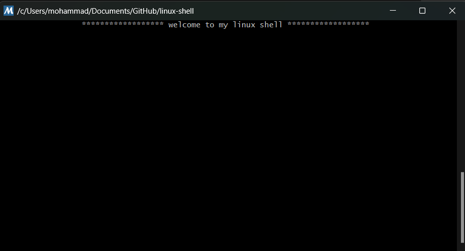
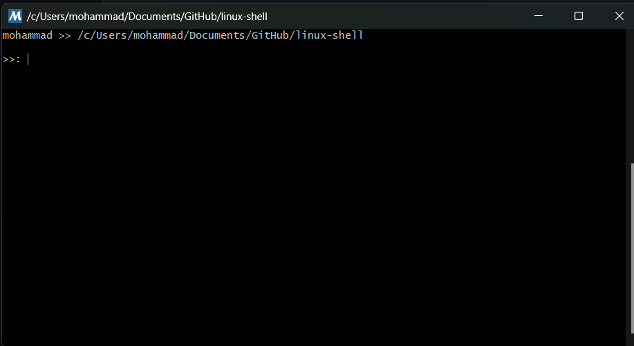
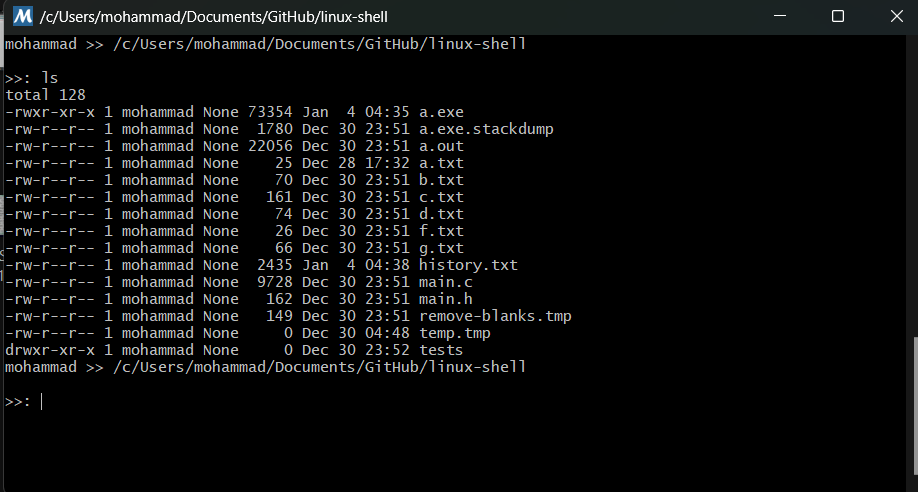
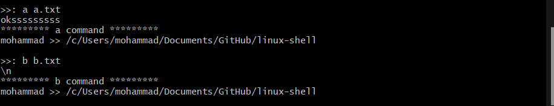
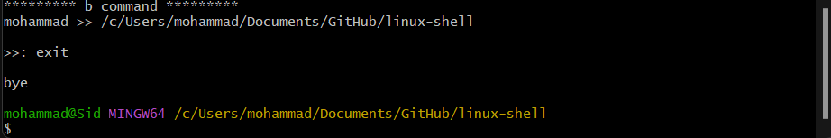

# linux-shell
>**simple linux shell with C**

program that represents a linux shell and supports linux shell commands
i have added some additional commands which they focus on file reading things

list of additional commands:
1. a -> returns the 1st part of given txt file
2. b-> returns the most frequent string in given txt file
3. c-> removes all empty spaces such as: space, \n, \t
4. d-> shows the not commented lines in the txt file
5. f-> returns number of lines in the txt file
6. g-> returns the first n line of the txt file

it has a simple history txt file which contains all program recent commands

some examples of commands:

